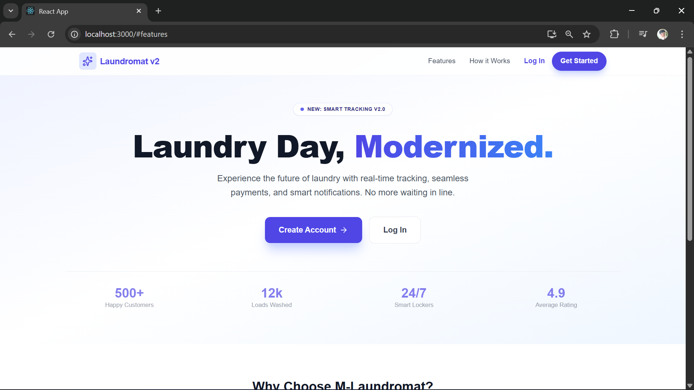
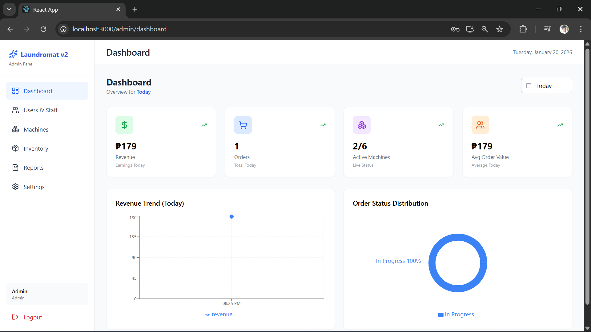
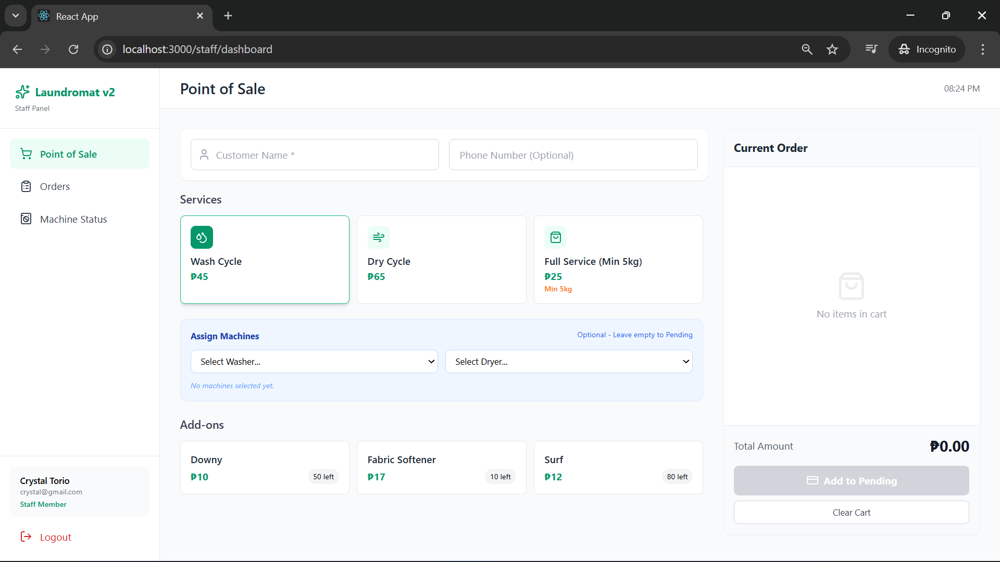
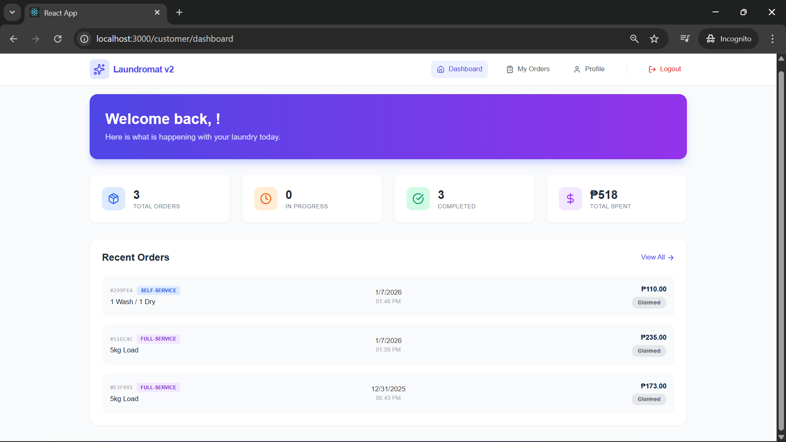

# 🧺 M-Laundromat v2.0 - Smart Laundry Management System


> A modern, full-stack solution to digitize laundromat operations. Connects customers, staff, and machines for real-time order tracking, inventory management, and business analytics.

---

## 📖 Table of Contents

- [Overview](#-overview)
- [Key Features](#-key-features)
- [Tech Stack](#-tech-stack)
- [Screenshots](#-screenshots)
- [Installation & Setup](#-installation--setup)
- [Environment Variables](#-environment-variables)
- [Project Structure](#-project-structure)
- [Future Roadmap](#-future-roadmap)

---

## 🚀 Overview

**M-Laundromat v2** is a web-based platform designed to streamline the daily workflow of a laundry business. Unlike traditional POS systems, this application creates a synchronized ecosystem:

1.  **Customers** can track their laundry progress (Washing -> Drying -> Ready) from home.
2.  **Staff** use a POS interface to create orders and assign them to specific IoT-simulated machines.
3.  **Admins** get a bird's-eye view of revenue, inventory, and machine health.

---

## ✨ Key Features

### 👤 For Customers

- **Real-Time Tracking:** View the status of laundry (Queued, Washing, Drying, Folded).
- **Profile Management:** Manage contact details for seamless POS linking.
- **Email Notifications:** Receive alerts when laundry is ready.
- **Mobile Responsive:** Optimized for tracking on smartphones.

### 🏪 For Staff (POS)

- **Quick Order Creation:** Calculate prices based on weight (kg) or load type.
- **Machine Linking:** Assign specific washers/dryers to customer orders.
- **Queue Management:** Handle walk-ins and drop-offs efficiently.
- **Receipts:** Generate digital order summaries.

### 🛡️ For Admins

- **Dashboard Analytics:** Visualize revenue, active loads, and customer growth.
- **User Management:** Add/Remove Staff and manage permissions.
- **Machine Management:** Monitor machine status (Available, In Use, Maintenance).
- **Inventory Tracking:** Track detergent/softener stock and get low-stock alerts.

---

## 🛠 Tech Stack

### Frontend

- **Framework:** React.js (v18+)
- **Styling:** Tailwind CSS (Responsive Design)
- **State Management:** React Context API
- **Routing:** React Router v6 (Lazy Loading & Protected Routes)
- **Icons:** Lucide React
- **HTTP Client:** Axios

### Backend

- **Runtime:** Node.js
- **Framework:** Express.js
- **Database:** MongoDB (Mongoose ODM)
- **Authentication:** JWT (JSON Web Tokens) & Bcrypt
- **Email Service:** Nodemailer (Gmail SMTP)

---

## 📸 Screenshots

|                Landing Page                |            Admin Dashboard             |
| :----------------------------------------: | :------------------------------------: |
|  |  |

|              Staff POS              |               Customer Tracking               |
| :---------------------------------: | :-------------------------------------------: |
|  |  |

---

## ⚡ Installation & Setup

Follow these steps to run the project locally.

### Prerequisites

- Node.js (v14 or higher)
- MongoDB (Local or Atlas URL)

### 1. Clone the Repository

```bash
git clone [https://github.com/your-username/m-laundromat-v2.git](https://github.com/your-username/m-laundromat-v2.git)
cd m-laundromat-v2
```
